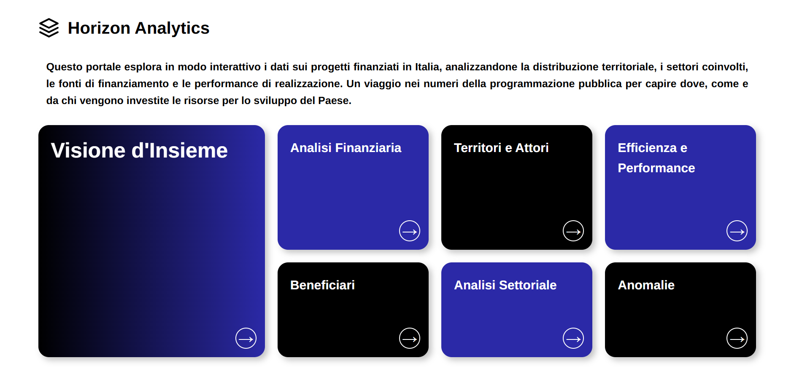

# Horizon Analytics

A transparency platform for monitoring European and national cohesion funds in Italy. This project aims to provide citizens, researchers, public institutions and journalists with an accessible and interactive web tool to better understand how European resources are allocated and utilized across the country.


---

## Table of Contents
- [Overview](#overview)
- [Features](#features)
- [Requirements](#requirements)
- [Getting Started](#getting-started)
- [Configuration](#configuration)
- [API Documentation](#api-documentation)
- [License](#license)

---

## Overview

**Horizon Analytics** is a web platform designed to enhance transparency in the management of European and state cohesion funds in Italy. By aggregating, processing and visualizing data, the platform provides users with clear insights into how resources are distributed, which projects are funded and how public investments impact local communities.

---

## Features

- **Interactive dashboards** for exploring projects and fund allocation
- **Location-based visualizations** to analyze investments by region or municipality
- **Search and filtering** for detailed queries
- **Modular Docker-based architecture** to facilitate development

---

## Requirements

To run the project locally, ensure the following:

### On Windows
- Install **Docker Desktop**

### On Linux
- Install **Docker** and **Docker Compose**

---

## Getting Started

### Clone the repository
```bash
git clone https://github.com/yourusername/Horizon_Analytics
cd Horizon_Analytics
```

### Create a .env file in the project root
Before starting the application, you must create a .env file containing your environment variables.
These values are required to configure the database connection and the Django backend
```bash
POSTGRES_DB=
POSTGRES_USER=
POSTGRES_PASSWORD=
POSTGRES_HOST=
POSTGRES_PORT=5432

# You can generate a secure Django secret key using:
# python -c "from django.core.management.utils import get_random_secret_key; print(get_random_secret_key())"
SECRET_KEY=
```

### Start the application using Docker
Once your .env file is configured, you can build and launch the entire stack:
```bash
docker-compose up --build
```
### Accessing the platform
After all services have started, open your web browser and navigate to:
[http://localhost:8000](http://localhost:8000)

### Stop the containers
To gracefully shut down all running services, use the following command
```bash
docker-compose down
```
---

## API Documentation

The platform exposes a REST API for accessing data on projects and fund allocation.
You can explore the API interactively using **Swagger UI**:

[View API Documentation](https://breaking-code-project-work.github.io/Horizon_Analytics/)

This documentation is generated from the OpenAPI specification (`openapi.yaml`) included in the `/docs` folder of this repository.
It provides details about all available endpoints, request parameters and response formats.

You can also use the YAML specification to generate client code or integrate it into other tools.

---

## License
This project uses datasets provided by **OpenCoesione**, released under the
**Creative Commons Attribution 4.0 International License (CC BY 4.0)**.

### You are free to:

- **Share** — copy and redistribute the material in any medium or format
- **Adapt** — remix, transform, and build upon the material for any purpose, even commercially

### Under the following terms:

- **Attribution** — You must give appropriate credit, provide a link to the license and indicate whether any changes were made
- **No additional restrictions** — You may not apply legal terms or technological measures that legally restrict others from doing anything the license permits

### License Information
- **Canonical License**: https://creativecommons.org/licenses/by/4.0/

### Dataset Source
- **OpenCoesione**: https://opencoesione.gov.it/it/opendata/#!basedati_section

